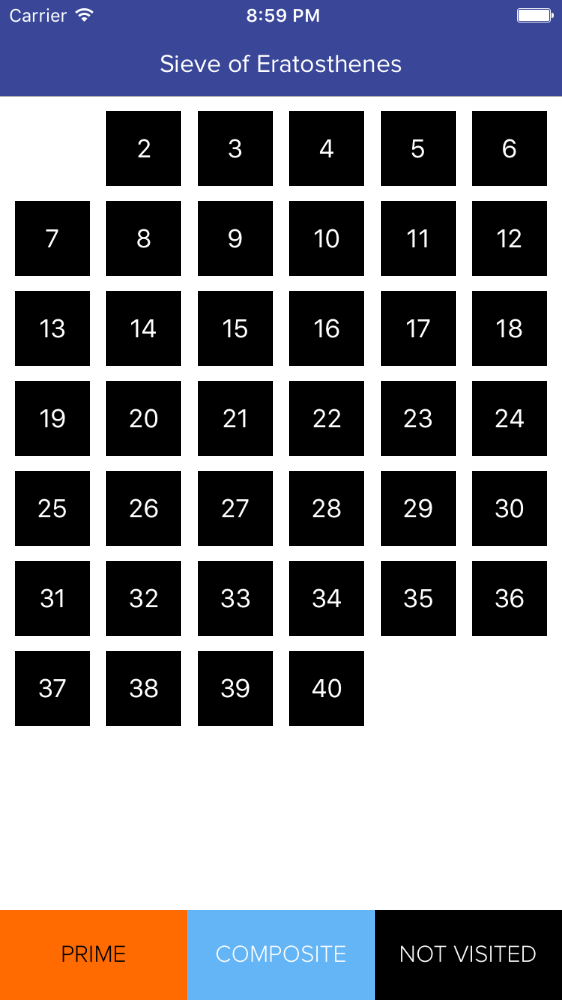
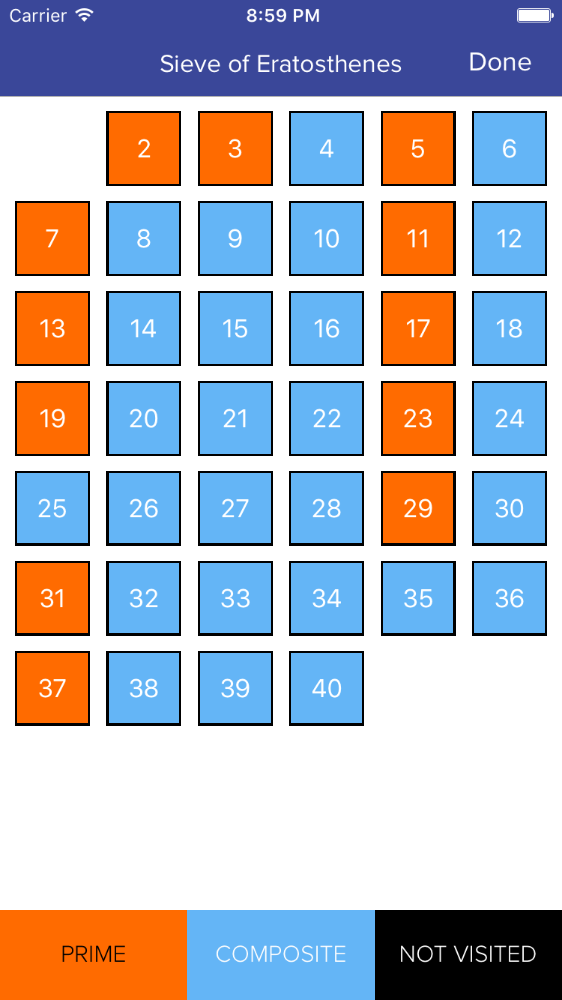

# Sieve-of-Eratosthenes (iOS - Objective-C)

An algorithm for finding all prime numbers up to any given limit.

It does so by iteratively marking as composite (i.e., not prime) the multiples of each prime, starting with the multiples of 2.

The multiples of a given prime are generated as a sequence of numbers starting from that prime, with constant difference between them that is equal to that prime. This is the sieve's key distinction from using trial division to sequentially test each candidate number for divisibility by each prime.

Source : https://en.wikipedia.org/wiki/Sieve_of_Eratosthenes

# Project Outline

To find all the prime numbers less than or equal to a given integer n by Eratosthenes' method:

1. Create a list of consecutive integers from 2 through n: (2, 3, 4, ..., n).

2. Initially, let p equal 2, the smallest prime number.

3. Enumerate the multiples of p by counting to n from 2p in increments of p, and mark them in the list (these will be 2p, 3p, 4p, ... ; the p itself should not be marked).

4. Find the first number greater than p in the list that is not marked. If there was no such number, stop. Otherwise, let p now equal this new number (which is the next prime), and repeat from step 3.

When the algorithm terminates, the numbers remaining not marked in the list are all the primes below n.

# Screenshots

 

 

# Requirements

- Xcode 7.2
- iOS 9

